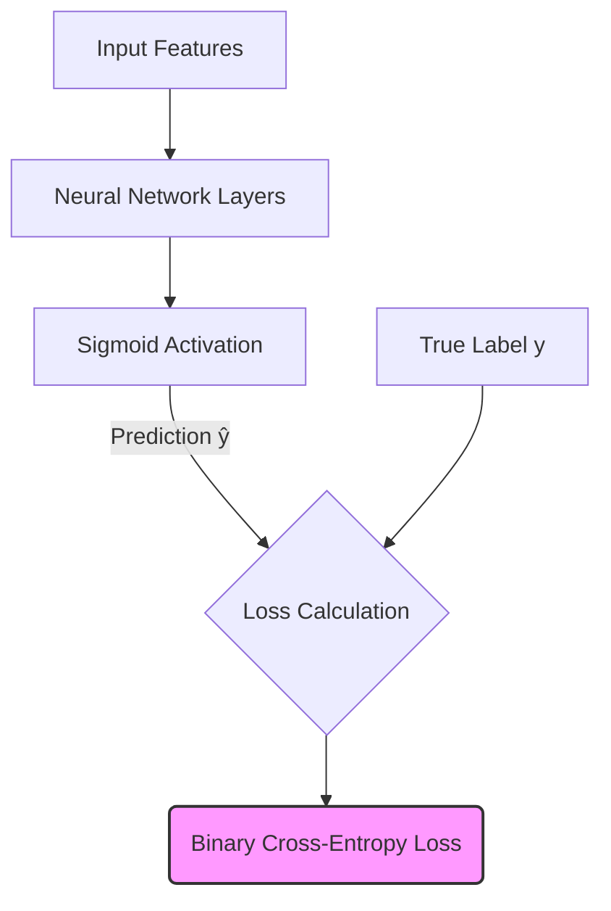

# Binary Cross-Entropy (Log Loss)

Binary Cross-Entropy (BCE), also known as Log Loss, is a loss function used in binary classification tasks. These are problems where the output variable can take exactly two mutually exclusive states (e.g., True/False, 1/0, Yes/No, Spam/Ham).

## History & First Use
BCE builds conceptually upon logistic regression. It was formally structured for statistical applications in the seminal 1958 paper by **D. R. Cox**: [*The Regression Analysis of Binary Sequences*](https://www.jstor.org/stable/2983890). Over time, as neural networks emerged, this metric naturally adapted as the standard for any node evaluating a binary choice.

## Mathematical Concept
The loss formula calculates the penalty for an incorrect prediction, scaling logarithmically with the confidence of that incorrect prediction.

`Loss = -[y * log(ŷ) + (1 - y) * log(1 - ŷ)]`

Where:
- `y` is the true label (0 or 1).
- `ŷ` is the predicted probability (between 0 and 1).

## Diagram

[Back to README](README.md)
