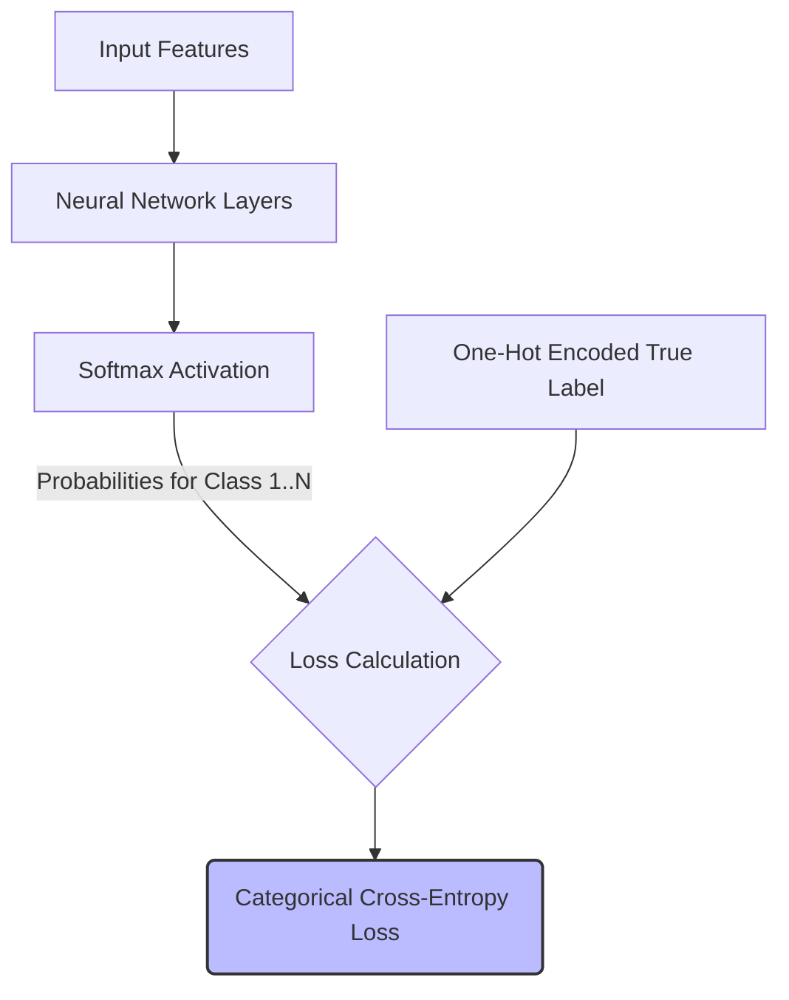

# Categorical Cross-Entropy (Multi-Class)

Categorical Cross-Entropy (CCE) is used for multi-class classification problems where an input can belong to exactly one category out of a predefined set of three or more possible options. 

## History & First Use
The formulation of categorical cross-entropy in the context of neural networks gained significant traction following the introduction of the Softmax activation function. **John S. Bridle** popularized this pairing in his 1989 paper, [*Probabilistic Interpretation of Feedforward Classification Network Outputs, with Relationships to Statistical Pattern Recognition*](https://proceedings.neurips.cc/paper/1989/file/8f14e45fceea167a5a36dedd4bea2543-Paper.pdf). Bridle demonstrated that optimizing this cross-entropy loss yielded solid probabilistic interpretations for multi-class classifiers.

## Mathematical Concept
The target labels are generally one-hot encoded. The loss compares the predicted probability distribution over the classes with the true distribution.

`Loss = -Σ (y_c * log(ŷ_c))`

Where:
- `y_c` is the true probability for class `c` (typically 1 for the correct class, 0 otherwise).
- `ŷ_c` is the predicted probability for class `c`.

## Diagram

[Back to README](README.md)
