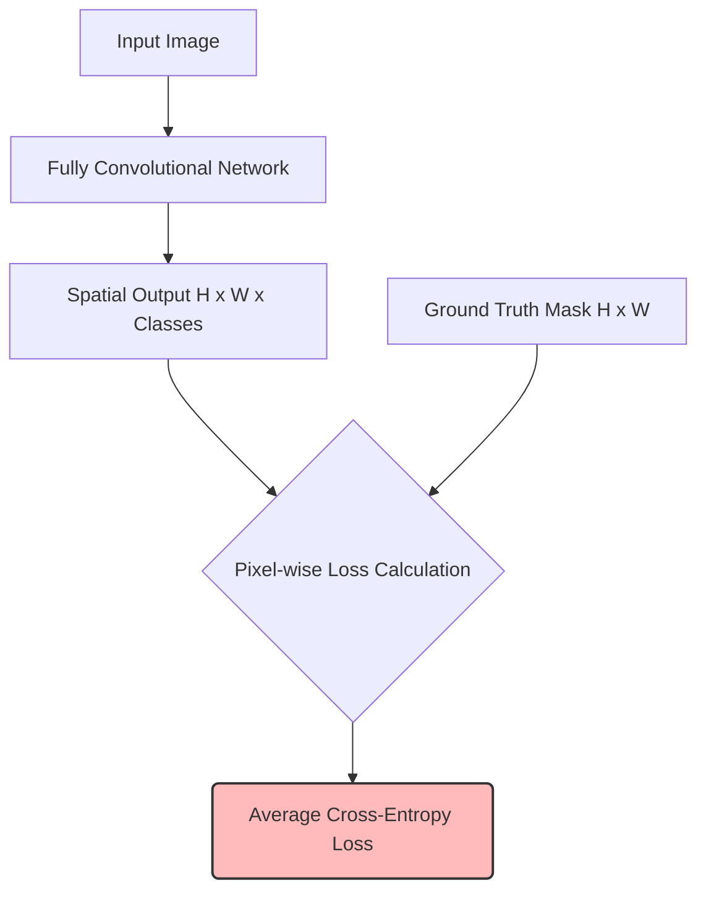

# Image Segmentation

Image segmentation tasks shift the perspective of classification from the macroscopic to the microscopic. Instead of labeling a whole image as "Cat", the network must label every individual pixel as either "Cat", "Background", etc.

## History & First Use
Applying cross-entropy loss at a pixel-wise level for end-to-end deep learning segmentation was popularized by the **2015** paper: [*Fully Convolutional Networks for Semantic Segmentation*](https://arxiv.org/abs/1411.4038) by **Jonathan Long, Evan Shelhamer, and Trevor Darrell**. It established a paradigm shift for analyzing medical imagery, satellite photos, and self-driving car vision.

## Concept
The final output is a spatial map of probabilities. The loss function is simply the average of the Categorical (or Binary) Cross-Entropy calculated independently for every pixel in the image against its corresponding pixel in the ground-truth mask.

## Diagram

[Back to README](README.md)
