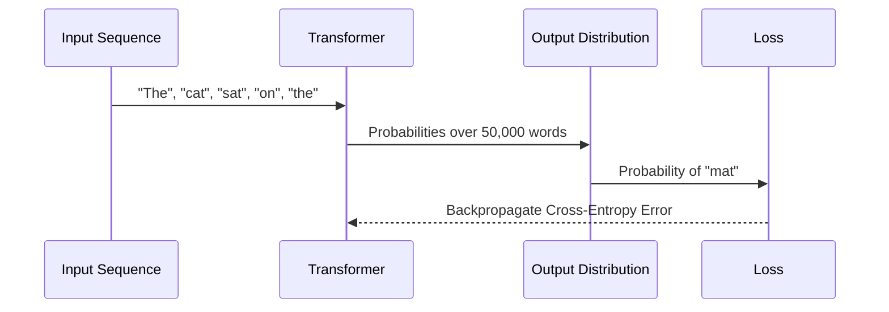

# Sequence/Language Modeling

In language modeling, the goal is typically autoregressive: predicting the very next word (or token) in a sequence given all the previous words. Cross-Entropy Loss evaluates these predictions over an entire vocabulary.

## History & First Use
While information theory's roots go back to Claude Shannon, using cross-entropy for neural language models gained a foundational blueprint with **Yoshua Bengio et al.** in their **2003** breakthrough paper: [*A Neural Probabilistic Language Model*](https://www.jmlr.org/papers/volume3/bengio03a/bengio03a.pdf). This laid the groundwork for modern LLMs like GPT and Llama.

## How it Works
At each step of a sequence, the model outputs a probability distribution over the entire vocabulary. Cross-Entropy penalizes the model based on the log probability assigned to the actual next word in the text corpus.

## Diagram

[Back to README](README.md)
