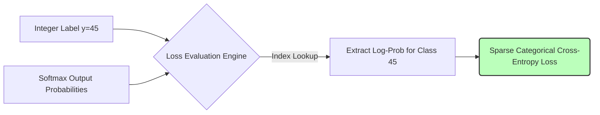

# Sparse Categorical Cross-Entropy

Sparse Categorical Cross-Entropy is mathematically identical to Categorical Cross-Entropy but introduces a crucial computational optimization. Rather than requiring dense one-hot encoded vectors, it directly accepts integer labels.

## History & First Use
As datasets grew massively (like ImageNet with its 1,000 classes), the memory footprint of one-hot arrays became a bottleneck. This optimization was pioneered and standardized around **2015** within frameworks like TensorFlow. A foundational paper describing the underlying system architecture for such scale is [*TensorFlow: Large-Scale Machine Learning on Heterogeneous Distributed Systems*](https://arxiv.org/abs/1603.04467).

## Why Use It?
- **Memory Efficiency:** Storing the integer `45` uses far less RAM than storing an array of 999 zeros and a single one.
- **Performance:** Bypassing one-hot decoding speeds up matrix operations during backpropagation.

## Diagram

[Back to README](README.md)
